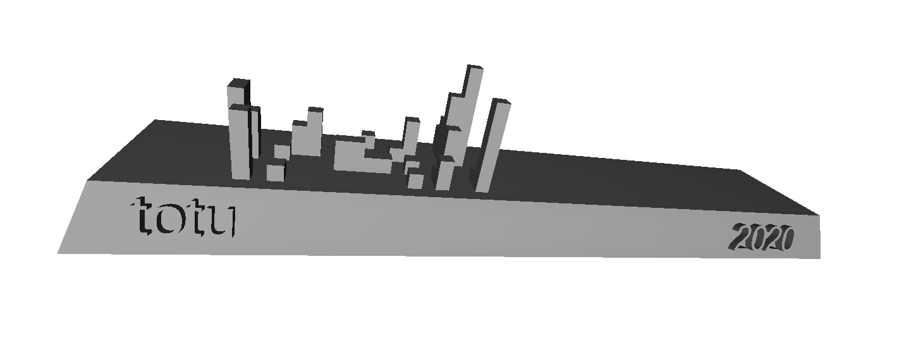

# Git commit skyline

# Usage

## Option 1:

Copy `skyline.py` into whatever repo you want to make the skyline out of and run it.

## Option 2:

Run skyline in a docker with following command:

`$ docker run -v <path-to-repo-you-want-to-skyline>:/workspace $(docker build -q .)`

**NOTE!** on ARM based system (such as Apple M1) you will need to use `--platform linux/amd64` flag since alpine linux does not currently have OpenSCAD package for ARM.

# Attributions

SCAD & STL code ripped from [Félix Gómez's gitlab skyline](https://github.com/felixgomez/gitlab-skyline/)
